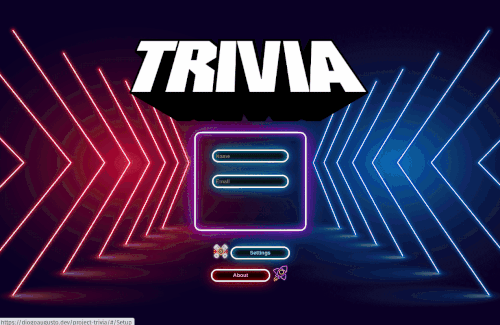
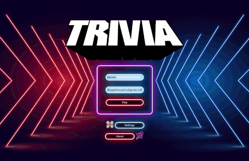
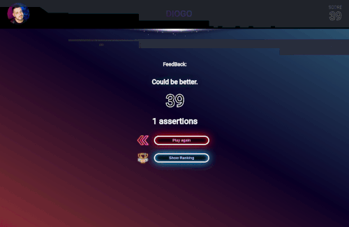

# Projeto Game Trivia

Desenvolvimento de um jogo de perguntas e respostas baseado no jogo **Trivia** no formato Web, utilizando _React e Redux_, desenvolvendo em grupo suas funcionalidades de acordo com as demanas definidas em um quadro _Kanban_. 

 <a href="https://diogoaugusto.dev/project-trivia/">Clique aqui para conferir o Deploy.</a>

### 🛠 Tecnologias e Ferramentas Utilizadas:

- [x] REACT
- [x] RTL
- [x] SPA
- [x] API
- [x] ESLINT
- [x] ROUTER
- [x] HTML5
- [x] CSS3

### 💻 Desenvolvedores:

- [Camilo Lelis](https://github.com/camiloLelis)

- [Diogo Augusto](https://github.com/diogotrescastro)

- [Josan Johnata](https://github.com/josanjohnata)

- [Marcos Mantovani](https://github.com/mvmes2)

 ### <a href="https://diogoaugusto.dev/" target="blank">👉 Clique e Confira meu Portfólio</a>

 ### 🤝 Conecte-se Comigo:

# project-trivia
